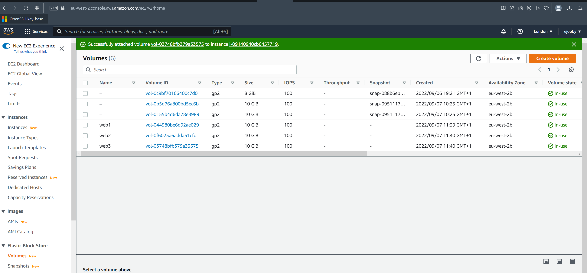

# Project-6

# Web Solutions with Wordpress

First create two instances of Redhat Server on AWS EC2 and name them Web Server and Database Server..

Create 6 volumes of 10Gb on the console and attached 3 volumes each to the two instances created

## Prepare the Web Server

Launch the first instance of the Redhat Linux Server named Webserver by connection to it via the terminal

Check whether the Volumes created are attached

`lsblk`

The three volumes xvdf, xvdg, xvdh created will be listed

Then use the gdisk to partition the three disk

