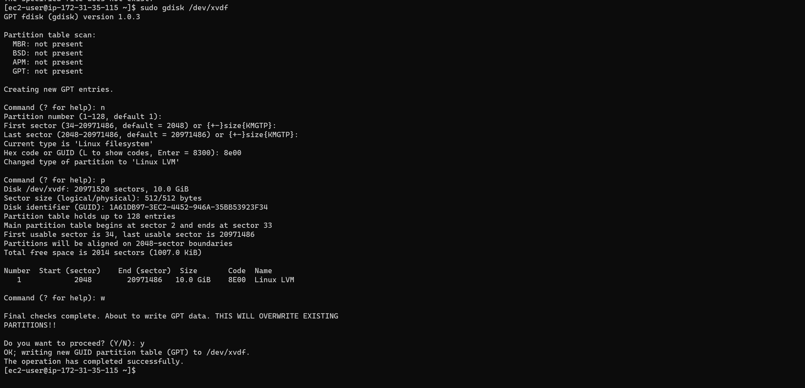
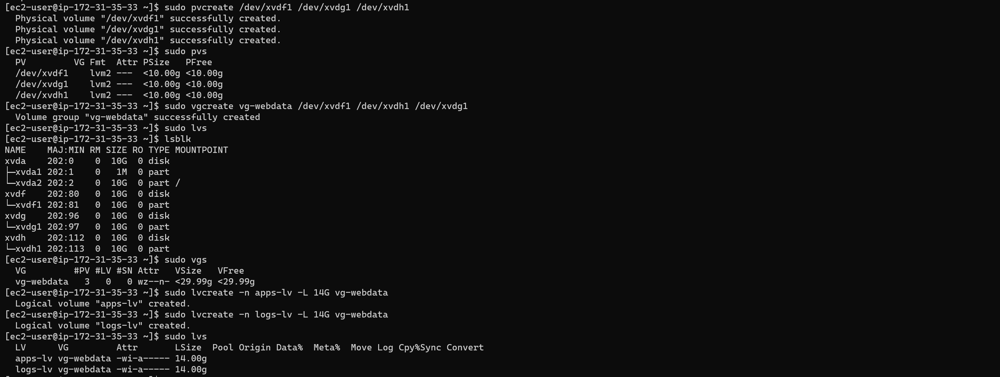
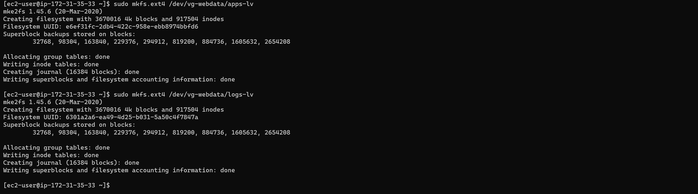
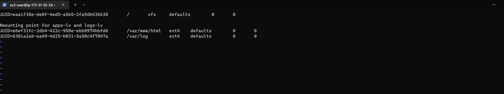
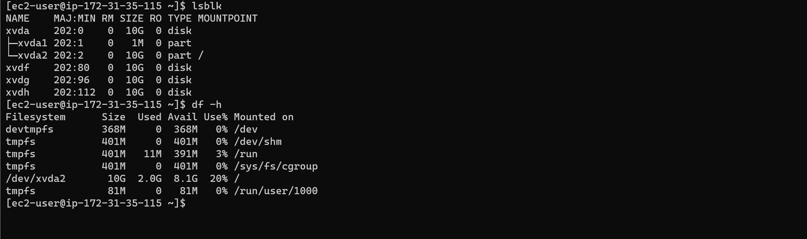
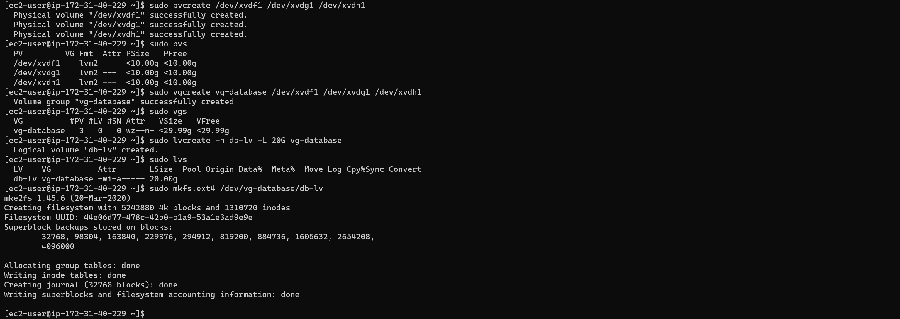
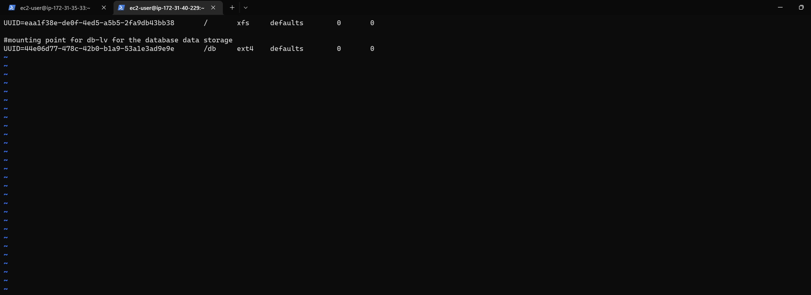
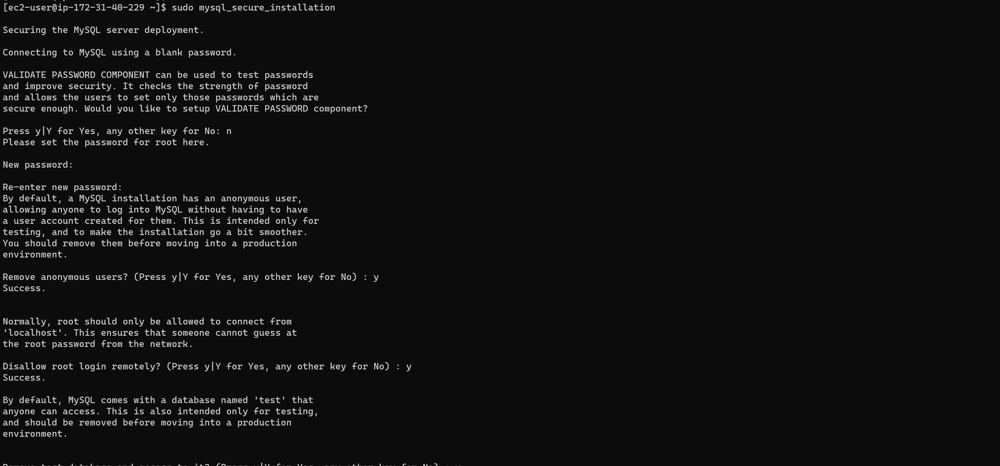

# Project-6

# Web Solutions with Wordpress

First create two instances of Redhat Server on AWS EC2 and name them Web Server and Database Server..

Create 6 volumes of 10Gb on the console and attached 3 volumes each to the two instances created


## Prepare the Web Server

Launch the first instance of the Redhat Linux Server named Webserver by connection to it via the terminal

Check whether the Volumes created are attached

`lsblk`

The three volumes xvdf, xvdg, xvdh created will be listed

Then use the gdisk to partition the three disk

`sudo gdisk /dev/xvdf`



Repeat the Process for /dev/xvdg and /dev/xvdh

Then Install LVM

`sudo yum update -y`

`sudo yum install lvm2 -y`

Use pvcreate utility to mark each of 3 disks as physical volumes (PVs) to be used by LVM

`sudo pvcreate /dev/xvdf1 /dev/xvdg1 /dev/xvdh1`

`sudo pvs`

Use vgcreate utility to add all 3 PVs to a volume group (VG). Name the VG webdata-vg

`sudo vgcreate vg-webdata /dev/xvdf1 /dev/xvdg1 /dev/xvdh1`

`sudo vgs`

Use lvcreate utility to create 2 logical volumes. apps-lv and logs-lv


`sudo lvcreate -n apps-lv -L 14G vg-webata`

`sudo lvcreate -n logs-lv -L 14G vg-webata`

`sudo lvs`



Use mkfs.ext4 to format the logical volumes with ext4 filesystem

`sudo mkfs.ext4 /dev/vg-webdta/apps-lv`

`sudo mkfs.ext4 /dev/vg-webdta/logs-lv`



Create /var/www/html directory to store website files

`sudo mkdir -p /var/www/html`

Create /home/recovery/logs to store backup of log data

`sudo /home/recovery/logs`

Mount /var/www/html on apps-lv logical volume

`sudo mount /dev/vg-webdata/apps-lv /var/www/html/`

Use rsync utility to backup all the files in the log directory /var/log into /home/recovery/logs (This is required before mounting the file system)

`sudo rsync -av /var/log/. /home/recovery/logs/`

Mount /var/log on logs-lv logical volume. (Note that all the existing data on /var/log will be deleted. That is why the step above is very
important)

`sudo mount /dev/vg-webdata/logs-lv /var/log`

`sudo rsync -av /home/recovery/logs/. /var/log`

Update the /etc/fstab so as to maintain the mounting poing after restarting the server

Firstly get the UUID of the apps-lv and logs-lv and use it to update the /etc/fstab

`sudo blkid`

`sudo vi /etc/fstab`



`sudo mount -a`

`sudo systemctl daemon-reload`


## Prepare the Database Server

Launch the second instance of the Redhat Linux Server named Webserver by connection to it via the terminal

Check whether the Volumes created are attached

`lsblk`

`sudo df -h`



The three volumes xvdf, xvdg, xvdh created will be listed

Then use the gdisk to partition the three disk

`sudo gdisk /dev/xvdf`


Repeat the Process for /dev/xvdg and /dev/xvdh

Then Install LVM

`sudo yum update -y`

`sudo yum install lvm2 -y`

Use pvcreate utility to mark each of 3 disks as physical volumes (PVs) to be used by LVM

`sudo pvcreate /dev/xvdf1 /dev/xvdg1 /dev/xvdh1`

`sudo pvs`

Use vgcreate utility to add all 3 PVs to a volume group (VG). Name the VG webdata-vg

`sudo vgcreate vg-database /dev/xvdf1 /dev/xvdg1 /dev/xvdh1`

`sudo vgs`

Use lvcreate utility to create 2 logical volumes. apps-lv and logs-lv


`sudo lvcreate -n db-lv -L 20G vg-database`

`sudo lvs`



Use mkfs.ext4 to format the logical volumes with ext4 filesystem

`sudo mkfs.ext4 /dev/vg-database/db-lv`

Create /db directory to store the database data

`sudo mkdir -p /db`

Mount /db on apps-lv logical volume

`sudo mount /dev/vg-database/db-lv /db`

Update the /etc/fstab so as to maintain the mounting poing after restarting the server

Firstly get the UUID of the db-lv and use it to update the /etc/fstab

`sudo blkid`

`sudo vi /etc/fstab`



`sudo mount -a`

`sudo systemctl daemon-reload`

## Install WordPress on your Web Server EC2

Install wget, Apache and it’s dependencies

`sudo yum -y update`

`sudo yum -y install wget httpd php php-mysqlnd php-fpm php-json`

Start Apache

`sudo systemctl enable httpd`

`sudo systemctl start httpd`

To install PHP and it’s depemdencies. Copy each line of the code below on the terminal and run it ..

```
sudo yum install https://dl.fedoraproject.org/pub/epel/epel-release-latest-8.noarch.rpm
sudo yum install yum-utils http://rpms.remirepo.net/enterprise/remi-release-8.rpm
sudo yum module list php
sudo yum module reset php
sudo yum module enable php:remi-7.4
sudo yum install php php-opcache php-gd php-curl php-mysqlnd
sudo systemctl start php-fpm
sudo systemctl enable php-fpm
setsebool -P httpd_execmem 1
```

Restart Apache

`sudo systemctl restart httpd`

Download wordpress and copy wordpress to var/www/html . Copy the code per line and run it to achieve this purpose.

```
  mkdir wordpress
  cd   wordpress
  sudo wget http://wordpress.org/latest.tar.gz
  sudo tar xzvf latest.tar.gz
  sudo rm -rf latest.tar.gz
  cp wordpress/wp-config-sample.php wordpress/wp-config.php
  cp -R wordpress /var/www/html/
  
```

Configure SELinux Policies. copy the code line by line ans run

```
  sudo chown -R apache:apache /var/www/html/wordpress
  sudo chcon -t httpd_sys_rw_content_t /var/www/html/wordpress -R
  sudo setsebool -P httpd_can_network_connect=1
  ```

  ## Install MySQL on your DB Server EC2

  `sudo yum -y update`
  
  `sudo yum install mysql-server`

  `sudo mysql_secure_installation`

  

  